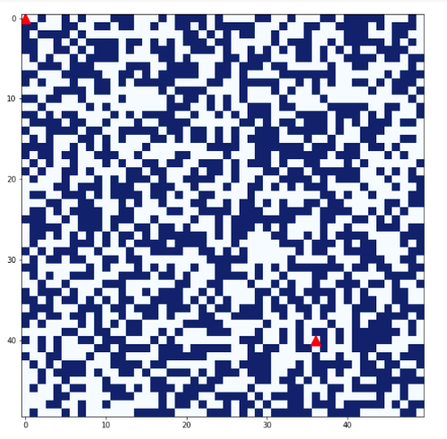
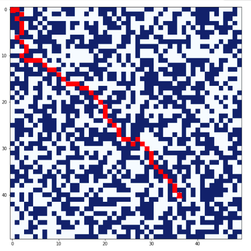

# A--AI-Maze-solver
##Play live here : [LIVE](https://replit.com/@prilily/aalgo-1?v=1)

Implementation of A* algorithm (in Python):an artificial intelligence problem used for the path-finding &amp;the Graph traversals

Read my blog here [BLOG](https://priyankamessage.medium.com/ai-maze-solver-using-a-path-finding-algorithm-7d09d6d1dd48)

Visualizing maze drawn and path found in matplotlib:

GUI-based Maze-Game using AI solver

